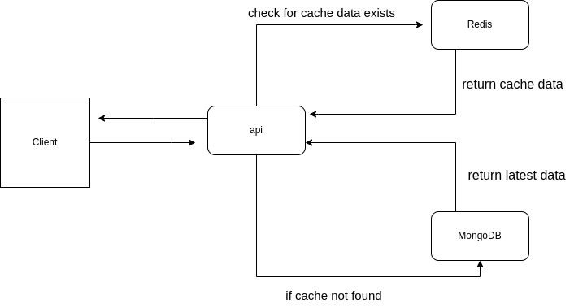

# Visitor Tracking App

## Description

A simple visitor tracking app. where every visitor will input their name, email, phone. when they make entry will be on database.

- React
- Express
- MongoDB
- redis

## How to run

### prerequisites

- Docker

```
git clone https://github.com/zahidcse98/poridhi_track_exam_1-zahidcse98.git
cd poridhi_track_exam_1-zahidcse98
```

### For Client

```
cd client-app
yarn
yarn dev
```

### For api (open another terminal window)

```
cd api
yarn start
```

## Workflow diagram



## Api working

- [x] At the very first loading get api will call and existed all data will be shown
- [x] if we add data then the cached data will be invalid and we will see the previous cached data
- [x] clicking on get data button we will get the latest updated data
